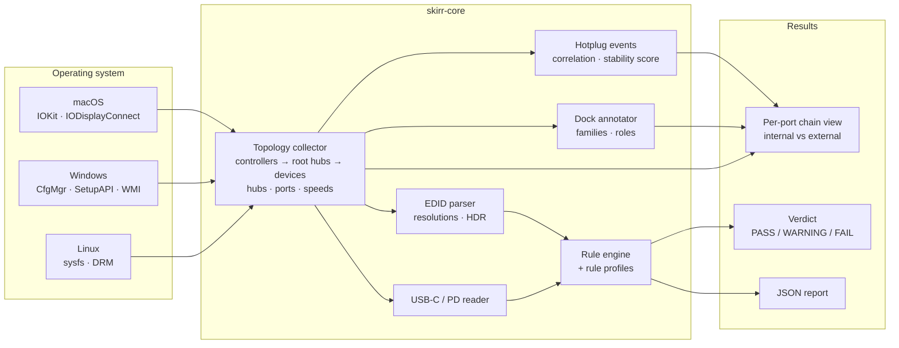

# skirr

Skírr – Old Norse for *clear, bright, pure*. A USB diagnostic tool for ProAV
systems. It maps the full device tree — hubs, ports, speeds and displays —
then shows exactly why a connection fails. No guessing: a clear verdict and
the facts behind it.

## Status

MVP feature-complete on **macOS** (Apple Silicon live-tested) and **Windows**
(code-complete, runner review pending). Linux and the GUI are on the roadmap —
see [SKIRR_PLANNER.md](SKIRR_PLANNER.md).

## How it works

Each platform backend collects raw facts through the OS's own APIs; everything
downstream of that is shared, platform-independent logic.



External devices are rendered **per physical port**: whatever you plug into a
port starts one chain that continues through every hub inside a dock, so the
product causing trouble in a long chain is visible at a glance:

```text
EXTERNAL
RootHub BUS_1 (on xHCI, 6 ports)
  Port 4 ── CalDigit Dock (2109:0102) [HUB 4p] [5000 Mbps]
  │ ├─ p2 Dock Sub-Hub (2109:0817) [HUB 3p] [480 Mbps]
  │ │ ├─ p1 Keyboard (05AC:0234) [1.5 Mbps]
  │ │ └─ p4 Camera (046D:0825) [480 Mbps]
  │ └─ p3 Flash Drive (0781:5583) [5000 Mbps]
  Ports free: 1, 2, 3, 5, 6
```

## Install

Grab the artifact for your platform from the latest release:

| OS | Arch | Artifact |
|----|------|----------|
| Windows | x64 | `.zip` (`skirr.exe`) |
| macOS | ARM64 (Apple Silicon) | `.dmg` (`Skirr.app`) |
| macOS | x64 (Intel) | `.dmg` (`Skirr.app`) |
| Ubuntu 22.04 | x86_64 | `.deb` (`/usr/bin/skirr`) |

Each artifact ships with a SHA-256 checksum file.

## First launch

Builds are currently unsigned/notarization-pending, so the OS asks for
confirmation exactly once per app.

### macOS

Downloads made through a browser carry the Gatekeeper quarantine flag. Clear
it once after copying `Skirr.app` into Applications:

```sh
xattr -dr com.apple.quarantine /Applications/Skirr.app
```

Or without Terminal: double-click `Skirr.app`, then open **System Settings →
Privacy & Security**, scroll to the *Security* section and click **Open
Anyway** next to the Skirr message.

### Windows (SmartScreen)

1. Run `skirr.exe`. Windows SmartScreen shows *"Windows protected your PC."*
2. Click **More info** → **Run anyway**.
3. The prompt appears once; afterwards the exe starts normally.

Both flows disappear once code signing certificates are in place.

## Documentation

- [docs/DATA_MAP.md](docs/DATA_MAP.md) — data sources per platform, field mapping
- [SKIRR_PLANNER.md](SKIRR_PLANNER.md) — roadmap and progress

## License

MIT
